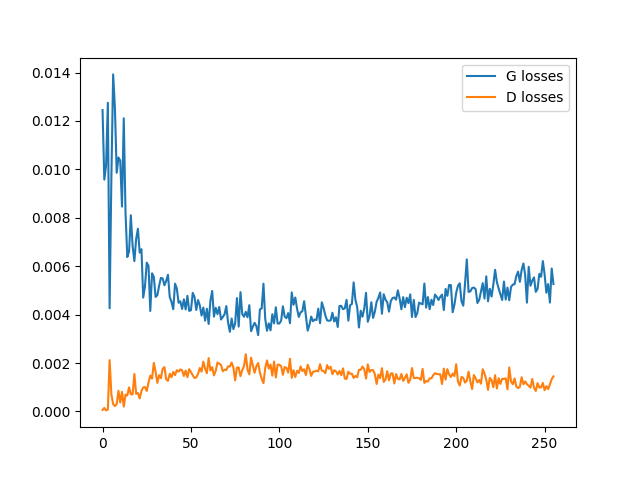

### PyTorch MNIST GAN

---

Generate hand-written numbers with GAN.

1. Up-to-date (published in 2024). Some projects contain deprecated functions, resulting in errors or many warnings.
2. Easy to use. Run the script with one line of code.
3. Real-time outputs. The program will output the loss, generated numbers, and progressive generated numbers (after the training).

---

##### Quick Start

It's better to use a clean conda environment.
>conda create --name gan_mnist --file requirements.txt
conda activate gan_mnist

Run the project (trained models are uploaded, so it's OK to test the trained model first; if you train the model, the uploaded models will be covered).
>bash run.sh train  
bash run.sh test

Note: all pictures will be saved in the **output** folder. If you train the model, the previous pictures will be covered by the new.

1. Output loss at terminal and output/train_loss.png.
2. Output epoch-generated numbers at output/train_status.png (the upper part is the real numbers, and the lower part is the generated numbers).
3. Output accumulated test results at train_progress.gif (after the training).
4. Output test results at output/test_status.png (test mode).
